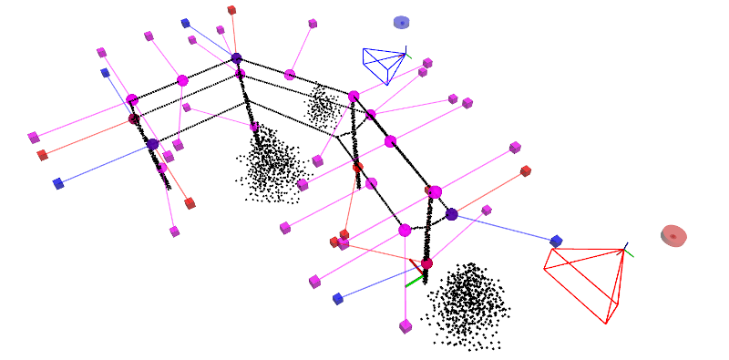

# MRS Summer School 2022: multi-robot inspection and monitoring

|        | 18.04                                                                                                                                        | 20.04                                                                                                                                       | 22.04                                                                                                                                       |
| :---   | :---:                                                                                                                                        | :---:                                                                                                                                       | :---:                                                                                                                                       |
| Status | [](https://github.com/ctu-mrs/summer-school-2022/actions) | [](https://github.com/ctu-mrs/summer-school-2022/actions) | [](https://github.com/ctu-mrs/summer-school-2022/actions) |

In this Summer School task, we will focus on the cooperation of a group of two UAVs (Unmanned Aerial Vehicles) in a 3D environment with obstacles.
The task is to plan collision-free trajectories of the UAVs so that cameras onboard the UAVs inspect a set of *N* unique inspection points.
Both UAVs have a predefined starting position and a limit on maximal velocity and acceleration.
The objective of the task is to minimize the time of inspection while capturing all the inspection points and not colliding the UAVs with the environment or with each other.
An already working solution is provided as a part of the assignment.
However, this example solution has poor performance and can be improved significantly.

## Installation

The Summer School 2022 will use the [MRS UAV System](https://github.com/ctu-mrs/mrs_uav_system) contained in a [Singularity](https://sylabs.io/singularity/) image.
A set of scripts is provided to create a layer of abstraction above the Singularity system, so the participants only need to know how to call a shell script, e.g.,
```bash
./script.sh
```
The following steps will download the main repository, install Singularity (only on Ubuntu-compatible OS), and download the pre-built Singularity image.
No further changes are made to the host operating system.

Requirements: Linux OS, approx. 5 GB of HDD space.
For a non-Ubuntu OS, please, install the Singularity on your own.

1) If you are a `git` veteran, you should `fork` the git repository [github.com/ctu-mrs/summer-school-2022](https://github.com/ctu-mrs/summer-school-2022). This will allow you to store changes to our code. Do not forget to make your fork private unless you want other participants to be able to peek into your code.
__UPDATE:__ Forked repositories on github cannot be made private. Workaround: Instead of forking the repository, click the plus sign in the top right corner, select Import repository, type in the original repo address `https://github.com/ctu-mrs/summer-school-2022.git` and then the name of your new repository. In the bottom part of the form, you can select Private. 
2) Clone the repository to `~/git`:
```bash
mkdir -p ${HOME}/git
cd ${HOME}/git && git clone https://github.com/ctu-mrs/summer-school-2022.git
```
3) **(on your personal computers only)** Run the installation script that will install dependencies, download the MRS singularity image containing [MRS UAV System](https://github.com/ctu-mrs/mrs_uav_system), and compile the workspace:
```bash
cd ${HOME}/git/summer-school-2022 && ./install.sh
```

## Task overview

You are given two UAVs (Red 🟥 and Blue 🟦) required to inspect a set of **inspections points (IPs)** as fast as possible in a 3D environment with obstacles.
The two UAVs are equipped with the [MRS control pipeline](https://github.com/ctu-mrs/uav_core) [1], allowing precise trajectory tracking.
Your task is to assign the IPs to the UAVs and to generate multi-goal paths visiting **viewpoints (VPs)** (poses in which the particular IPs are inspected with on-board cameras) of each IP while keeping a safe distance from the obstacles and between the two UAVs.
Furthermore, you shall convert paths to collision-free time-parametrized trajectories that respect the UAVs' dynamic constraints.
The IPs are defined by their position and inspection angle and are divided into three subsets:

1. 🔴 red locations: inspectable by 🟥 UAV only,
2. 🔵 blue locations: inspectable by 🟦 UAV only,
3. 🟣 purple locations: inspectable by both (🟥 or 🟦)  UAVs.



To inspect an IP, you have to visit its attached VP with a correct UAV within a radius of 0.3 m and with a maximum deviation in inspection heading and pitch of 0.2 rad.
**Each successfully inspected point increments your score by 1.**
The overall objective is to maximize the score while minimizing the flight time of both the UAVs.

The trajectories are required to begin and end at predefined starting locations.
The mission starts when the trajectories following is started and ends once the UAVs stop at their starting locations.
The motion blur effect during imaging is neglected; thus, the UAVs are not required to stop at particular VPs.

## Task assignment

There is a low-performance solution available at your hands.
This solution consists of:
  * non-controlled heading of the UAVs,
  * random assignment of IPs in 🟣 to UAVs,
  * computation of TSP (Traveling Salesman Problem) tours using Euclidean distance estimates,
  * planning paths with the use of badly parametrized RRT planner,
  * generation of trajectories with required zero velocity at the end of each straight segment,
  * collision avoidance is disabled.

The solution produced by this approach has very poor performance and does not score any points, yet provides large space for improvement.
To improve the solution, you can follow the steps suggested below or find your way to improve the solution.
Please go through the code and its inline comments to give you a better idea about individual tips.

**Tips for improving the solution:**

  1. Interpolate the heading between the samples. This is the first thing to solve if you want to score!
  2. Test different methods available for estimating the distance between the VPs and for planning collision-free paths connecting the VPs [available planners: A*, RRT (default), RRT*].
  3. Improve assignment of inspected points from 🟣 between the two UAVs (random by default).
  4. Try different parameters of path planners (e.g., grid resolution or sampling distance) and evaluate their impact on the quality of your solution.
  5. Increase performance of the chosen path planner (e.g., by path straightening or implementing informed RRT).
  6. Consider flight time instead of path length when searching for the optimal sequence of locations in TSP.
  7. Apply path smoothing and continuous trajectory sampling (no stops at waypoints) to speed up the flight. In the code, we have prepared the `toppra` library for computing path parametrizations [2]. Check out the documentation and try to utilize it.
  8. Postprocess the time-parametrized trajectories to resolve collisions. Start by improving the implemented collision avoidance, e.g., by delaying trajectory start till there is no collision. Tip: try the methods available for you in the config file (see below).
  9. Effectively redistribute IPs to avoid collisions and to achieve lower inspection time.

Note that the task in its generality is very complex to be solved in a limited time during several days.
You are not expected to solve every subproblem so do not feel bad if you don't.
Instead, try to exploit and improve the parts of the solution you are most interested in or think to improve the solution the most.
While designing your solution, do not forget to consider maximum computational time.
We limit your computational time to speed up the flow of the competition.
Although we prepared a skeleton solution as a baseline, **feel free to design your algorithms to improve the overall performance**.
Good luck!

**Things to avoid:**

* Too high minimum distance from obstacles could lead to path planners failing to find a path to some locations.
* Smoothing and shortening the path in locations of inspections could lead to missing the inspection point.
* Sampling on a grid with a small resolution could lead to errors emerging from discretization.

### Where to code changes
Change your code within directory `summer-school-2022/mrim_task/mrim_planner` in files:

  * `scripts/`
    * `planner.py`: Crossroad script where the path to your solution begins. Here you will find initial ideas and examples on how to load parameters.
    * `trajectory.py`: Contains functionalities for basic work with trajectories. Here, you can **interpolate heading** between the path waypoints and experiment with smoothing the paths, sampling the trajectories, computing collisions between points/paths/trajectories, or postprocessing trajectories to prevent collisions.
    * `solvers/`
      * `tsp_solvers.py`: This is where VPs assignment for TSP, path planning, and solving TSP happens. Here you can play with an efficient assignment of VPs to UAVs or study the effect of path planners on TSP solution performance.
    * `utils.py`: Default source of various utility functions. Feel free to add your own.
  * `config/`
    * `virtual.yaml` and `real_world.yaml`: Config files (for two challenges described below) containing various parameters/switches for the task. If you need other parameters, add them here, load them in `scripts/planner.py` and use them in the code accordingly.

In the files, look for keywords **`STUDENTS TODO`**, located in areas where you probably want to write/use some code.
By default, you should not be required to make changes to other than the above-specified files.

**Where else to look:**

Throughout the code, we use some custom classes as data types.
Check `mrim_planner/scripts/data_types.py` to see what the classes do.

Apart from the configs in `mrim_planner/config`, default configs for the mission are loaded from `mrim_manager/config` for each run type.
Take a look here to see the trajectories' dynamic constraints or safety limits.

### Run your code

A set of scripts is provided in `simulation/`, allowing you to start and stop the simulation and evaluate your code.
The **bold** scripts are expected to be used directly by the user.

| Script                 | Description                                                          |
| :---                   | :---:                                                                |
| 01_install.sh          | install the Singularity software                                     |
| 02_download.sh         | downloads the Singularity image                                      |
| **03_compile.sh**      | compiles the user's software (no need for changes in Python scripts) |
| **pycharm.sh**         | runs PyCharm inside Singularity                                      |
| **run_offline.sh**     | runs the solution without Gazebo simulation                          |
| **run_simulation.sh**  | runs the solution inside Gazebo simulation                           |
| **kill_simulation.sh** | kills the running simulation environment                             |
| singularity.sh         | entry point to the Singularity's shell, not needed most of the time   |

**1) Offline: lightweight without simulating UAV flight**

We recommend starting _offline_ (without using the simulator) when approaching the task for the first time.
The script below will run a solution to the task while showing the problem and the trajectories.
```bash
./simulation/run_offline.sh
```

After running the `run_offline.sh` script, you should see a similar visualization once the trajectory generation process is completed.
The RViz (ROS visualization) shows an **example solution** to the task.


The RViz window contains:

  * start/pause button in the left bottom corner
  * overall trajectories information in the top left/right corners (background is green if every check is OK, red otherwise)
  * current flight statistics right below
  * information about the mission and the score centered in the top

**2) Online: run simulation locally**

The script below will execute your solution to the task alongside the [Gazebo simulator](https://github.com/ctu-mrs/simulation) and the [MRS UAV system](https://github.com/ctu-mrs/mrs_uav_system) [1] simulating two UAVs.
```bash
./simulation/run_simulation.sh
```
Stopping the simulation is done by calling
```bash
./simulation/kill_simulation.sh
```
By default, the `run_simulation.sh` spawns you 2 UAVs in the `single_tower` world.
To change the world to `four_towers`, you have to

1. change the parameter `problem/name` in the `mrim_task/mrim_planner/config/virtual.yaml` to one of the `four_towers` problems (see section [Testing](https://github.com/ctu-mrs/summer-school-2022#testing)) and
2. change variable `PROBLEM` in `simulation/tmux_scripts/simulation/session.yml` from `export PROBLEM=single_tower` to `export PROBLEM=four_towers`.

You may notice that your terminal opened multiple tabs.
Check the first page of the [MRS Cheatsheet](https://github.com/ctu-mrs/mrs_cheatsheet) if you need help navigating the tabs and panes.

The terminal window will contain the interface of the Tmux: the terminal multiplexer.
It allows us to execute multiple commands in multiple terminals in one terminal window.
The Tmux window will contain "tabs" (panes), which are listed at the bottom of the window.
Switching between the tabs is done by the key combinations **shift→** and **shift←**.
The important tabs are listed below:

| Tab            | Description                                                                    |
| :---           | :---:                                                                          |
| planner        | the output of your planner                                                     |
| state_machine  | this node queries the planners for trajectories and handles the experiment     |
| start_planning | here, a command is prepared in the shell's history to start the planning again |
| control        | The MRS UAV System control pipeline                                            |

Please, **check the outputs of the programs for errors first before emailing and asking the MRS crew for help**.
Most often, the reason for your problem will be explained in some error message in one of the windows.

**3) Online: prepare for real-world experiments**

The preparation for a real-world experiment does not require any actions on your side.
You are required only to provide functional code for trajectory planning contained in the `mrim_planner`.
If you created other ROS nodes, which shall be run separately to the `mrim_planner`, include their launching in `mrim_planner/launch/planner.launch`.

## Testing

You have three problems prepared for testing and evaluating your solution.
The problems are located in `mrim_resources/problems`: you can switch between them by changing the `problem/name` line in `mrim_planner/config/virtual.yaml` to:

  1. `single_tower.problem` is a simple problem with a few IPs to test your initial solution, good for the development of path planning, trajectory sampling, and collision avoidance
  2. `four_towers_small.problem` is a simple problem with a few IPs and extra obstacles, good for clustering, improving TSP sequences, parametrizing the solution, and testing
  3. `four_towers_large.problem` is a complex problem with more than 30 IPs that will test your solution in full (**a similar problem will be used in the virtual competition** described below)

## Competition

There will be two competitions:

  1. In the virtual environment, and
  2. in the real world.

To participate in the competitions, you must send your solution in a single archive file by email until Thursday at 11:59 p.m.
Please, **email us** the code to `tomas.baca@fel.cvut.cz` with the subject **SUMMER SCHOOL TASK** till Thursday 11:59 p.m., zipped with your *Team's name* as:
```bash
zip -r my_team_name.zip mrim_planner
```
The submitted archive has to contain the whole package `mrim_planner`, including two config files (`real_world.yaml` and `virtual.yaml`) in the folder `mrim_planner/config`.
Please include the names of all team members in the email message.
**The late submissions will not be accepted for the competition**.

The evaluation of particular solutions in the real-world challenge will be performed on Friday, August 5th, with the real-time score presentation.
The virtual challenge will be evaluated on Friday.
The results will be presented during an awards ceremony organized at the experimental site after the real-world challenge.
**The final score of the solution equals the sum of successfully inspected IPs.**

**Reasons to assign zero score (and thus to disqualify the solution):**

  1. violation of assigned dynamic constraints of UAVs (**in horizontal and vertical directions only**; violation of constraints on heading does not affect the score but beware that the heading rate/acceleration of the UAV controller will be limited by these constraints),
  2. violation of minimum allowed distance between obstacles and UAVs,
  3. violation of minimum allowed mutual distance between UAVs,
  4. violation of maximum distance of final trajectory point to the predefined starting location,
  5. exceeding the hard maximum available time for computing a solution (see the table below).

In case of a tie, **secondary key** to determine the final order of the participating teams is given as $T_I + T_P$ (in seconds), where $T_I$ is the inspection time (start to end of both trajectories) and $T_P = max(0, T_C - T_s)$ is the time $T_C$ it took to compute the solution minus the the soft limit $T_s$ for computing the solution (see table below).

### Virtual

The dimensions of the virtual environment and inspection problem will be similar to `four_towers_large.problem`.
Your solution for the virtual environment has to conform to constraints summarized in the table below.

### Real-world

The dimensions of the real-world environment and inspection problem will be similar to `four_towers_*` but will be smaller by approximately 25%.
The same code as the virtual challenge will be run onboard real UAVs during the real-world challenge.
No changes are required on your side.
However, note that the evaluation of inspected points will be based on the actual pose of the UAV in the world, not the reference trajectories.
Hence, the effect of trajectory tracking will not be negligible, and you should consider the challenges of the real-world environment.
Consider the challenges during parametrization and prepare your solution for deviations from the ideal conditions. E.g., introduce reserves for UAV-to-UAV and UAV-to-obstacles distances to prevent unfortunate zeroing of your score or lower the magnitude of allowed deviations from the reference trajectory.
Your solution to both the challenges has to conform to constraints summarized in the following table:

| Constraint                                          | Virtual challenge | Real-world challenge |
| :---                                                | :---:             | :---:                |
| Maximum solution time (soft):                       | 40 s              | 30 s                 |
| Maximum solution time (hard):                       | 120 s             | 60 s                 |
| Maximum mission time:                               | 200 s             | 180 s                |
| Maximum velocity per x and y axes:                  | 2 m/s             | 1 m/s                |
| Maximum velocity in z axis:                         | 1 m/s             | 0.5 m/s              |
| Maximum acceleration per x and y axes:              | 2 m/s^2           | 1 m/s^2              |
| Maximum acceleration in z axis:                     | 1 m/s^2           | 0.5 m/s^2            |
| Maximum heading rate:                               | 0.5 rad/s         | 0.5 rad/s            |
| Maximum heading acceleration:                       | 1 rad/s^2         | 1 rad/s^2            |
| Minimum obstacle distance:                          | 1.5 m             | 2.0 m                |
| Minimum mutual distance:                            | 2.0 m             | 3.0 m                |
| Dist. from starting position to stop the mission:\* | 1.0 m             | 1.0 m                |

\* The last point of the trajectory is expected to match the starting point with up to 1 m tolerance.

## Explore another possible usage of the MRS UAV System

Based on the presentation of the MRS system, you can also try other capabilities of the system.
You selected a group of practicals based on your scientific interest.
Feel free to ask during the summer school and especially during the seminars how the system can be used for your area of interest.

## TROUBLESHOOTING

**Updating the repository**

If there is an update in the repository, you can pull it to your local machine using git:
```
cd ${HOME}/git/summer-school-2022 && git pull
```

**Google**

Before asking for help, try to come up with the answer on your own or with the assistance of a Google search.
Sometimes just writing the question down helps you to understand the problem.

**Contacts**

If you find a bug in the task, you need assistance, or you have any other questions, please contact by email one of (or all of):

  * Pavel Petracek `petrapa6@fel.cvut.cz`
  * Vit Kratky `kratkvit@fel.cvut.cz`
  * Tomas Baca `tomas.baca@fel.cvut.cz`

We will try to help you as soon as possible.

## DISCLAIMER

During the week of the 2022 MRS Summer School, the organizers reserve the right to:

  * to do fixes: to update the task in case of finding severe bugs in the code,
  * to maintain fairness: to change the problems or the constraints for the challenges,
  * to preserve safety: to discard provided trajectories for the real-world challenge if the flight would be unsafe in any possible way.

## REFERENCES

* [1]  Baca, T., Petrlik, M., Vrba, M., Spurny, V., Penicka, R., Hert, D., and Saska, M., [The MRS UAV System: Pushing the Frontiers of Reproducible Research, Real-world Deployment, and Education with Autonomous Unmanned Aerial Vehicles](https://arxiv.org/pdf/2008.08050), _Journal of Intelligent & Robotic Systems 102(26):1–28, May 2021_, GitHub: https://github.com/ctu-mrs/mrs_uav_system.
* [2]  H. Pham, Q. C. Pham, [A New Approach to Time-Optimal Path Parameterization Based on Reachability Analysis](https://www.researchgate.net/publication/318671280_A_New_Approach_to_Time-Optimal_Path_Parameterization_Based_on_Reachability_Analysis), [Documentation](https://hungpham2511.github.io/toppra/index.html)
